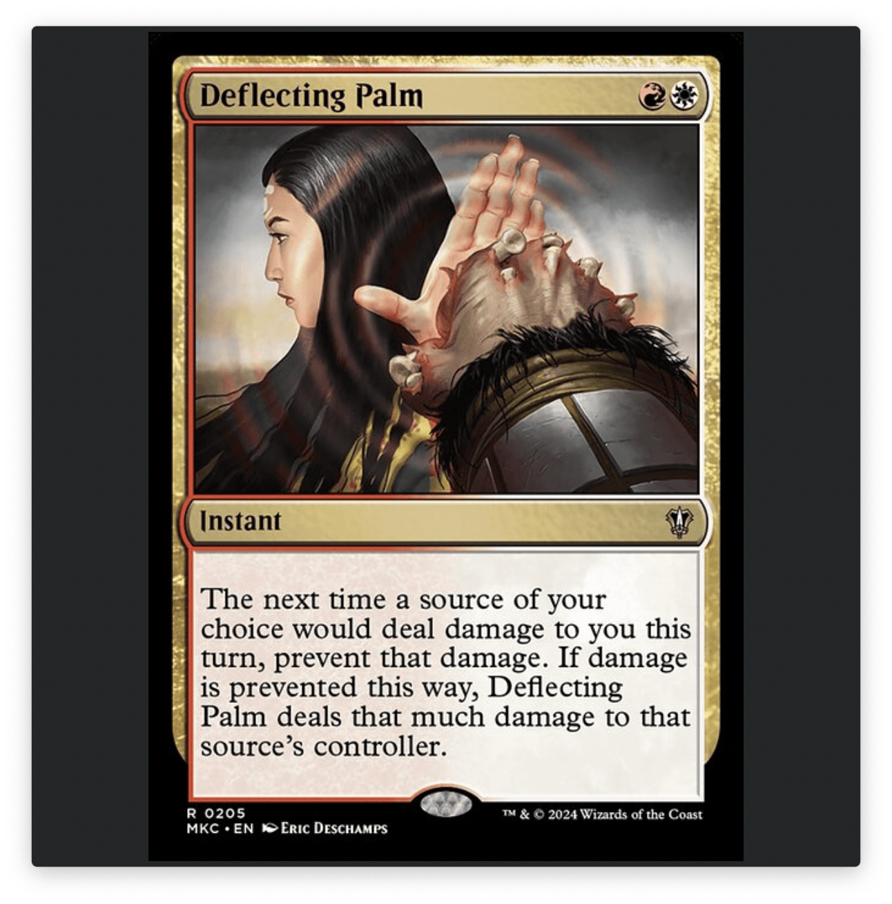
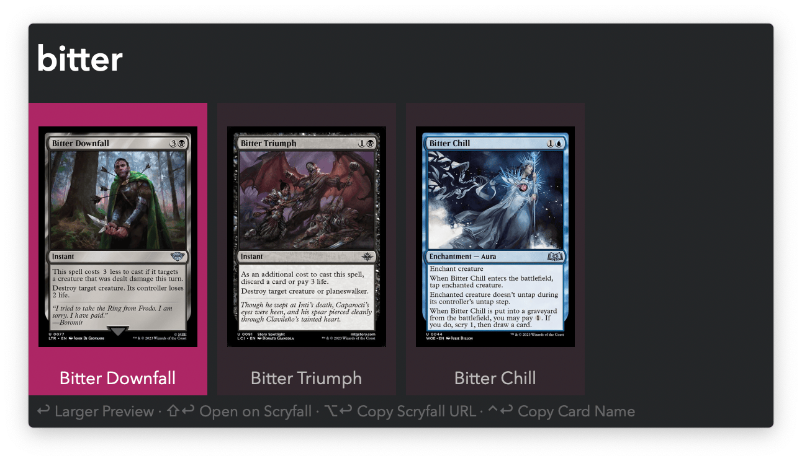

#  MTG Card Search Alfred Workflow

Search for Magic: The Gathering playing cards

[⤓ Install on the Alfred Gallery](https://alfred.app/workflows/vitor/mtg-card-search)

## Usage

Search for Magic: The Gathering cards via the `mtg` keyword.

* <kbd>↩</kbd> View card in Alfred. Press again to return to list.
* <kbd>⇧</kbd><kbd>↩</kbd> Open on [Scryfall](https://scryfall.com/).
* <kbd>⌥</kbd><kbd>↩</kbd> Copy Scryfall URL. Subsequent triggers append to the list.
* <kbd>⌃</kbd><kbd>↩</kbd> Copy card name. Subsequent triggers append to the list.
* <kbd>⌘</kbd><kbd>↩</kbd> Add to history. Happens automatically when opening a card.
* <kbd>⌘</kbd><kbd>Y</kbd> [Quick Look](https://www.alfredapp.com/help/features/previews/) the front face.

Search opened card history with the `mtghis` keyword.

The same shortcuts as above apply.
