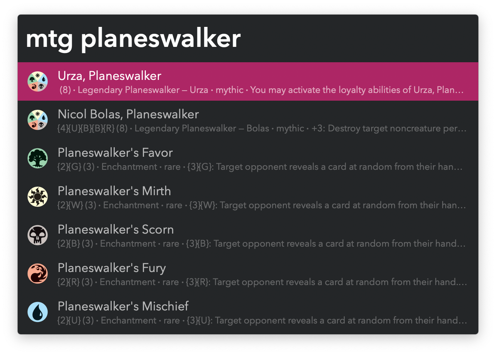

#  MTG Card Search Alfred Workflow

Search for Magic: The Gathering playing cards

<a href='https://alfred.app/workflows/vitor/mtg-card-search'>⤓ Install From the Alfred Gallery</a>

## Usage

Search for Magic: The Gathering cards via the Search Keyword (default: `mtg`).

* <kbd>⏎</kbd>: Open on [Scryfall](https://scryfall.com/).
* <kbd>⌘</kbd><kbd>⏎</kbd>: Paste the name and URL as a markdown link.
* <kbd>⌥</kbd><kbd>⏎</kbd>: Paste the name and URL separated by a colon.
* <kbd>⌘</kbd><kbd>Y</kbd> (or tap <kbd>⇧</kbd>): Quick Look the front face.

The card database is updated when older than two weeks. If necessary, an immediate cache rebuild can be forced with the `‌:mtgrebuild` keyword.
